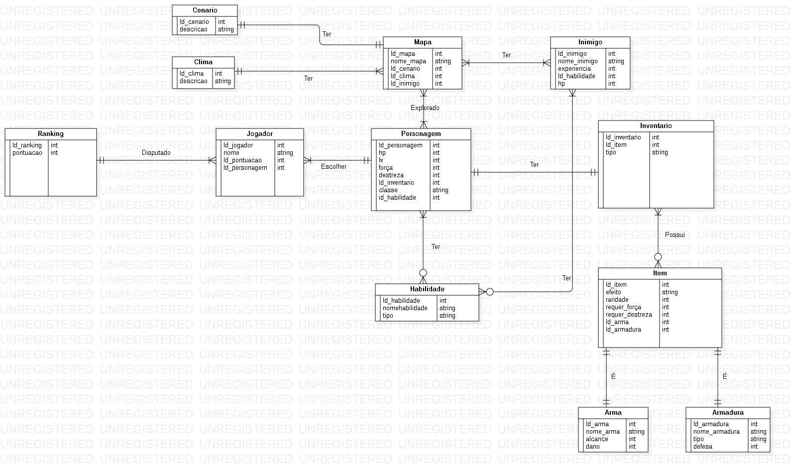
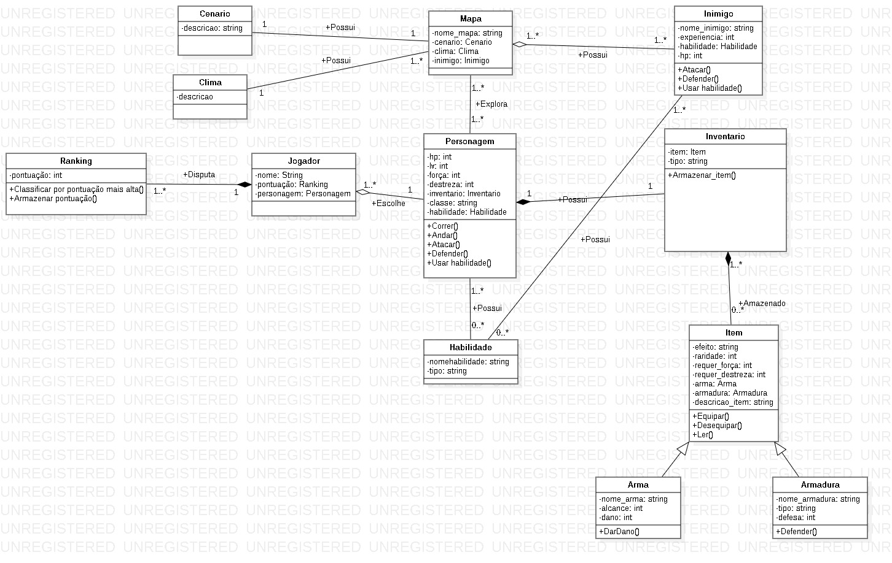

# Projeto---Parte-I-
Modelo Entidade Relacionamento, Modelo de Classes e Mapeamento Objeto-Relacional

  <h1 align="center">Diagrama MER</h1>
  

    
    
 
    
  <h1 align="center">Diagrama de Classe</h1>
  

    
    

